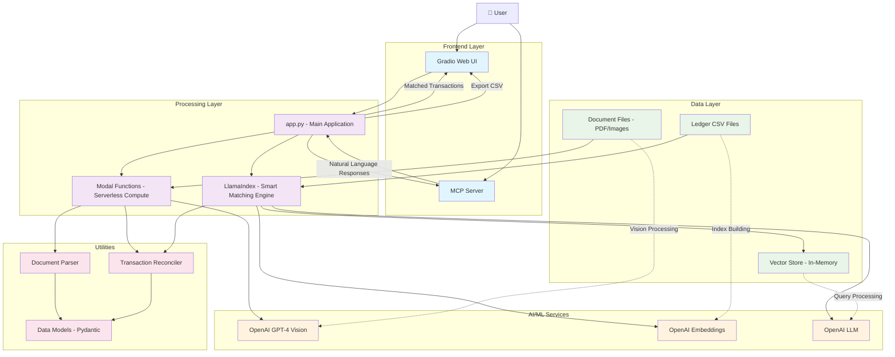

# SmartLedger - Smart Business Accounting Reconciler

[](https://huggingface.co/spaces/Agents-MCP-Hackathon/SmartLedger)

SmartLedger is an AI-powered accounting reconciliation tool that automates financial document processing and transaction matching. It uses Modal for serverless compute, LlamaIndex for intelligent transaction matching, and Gradio with MCP server for both UI and programmatic access.

## 🏗️ Architecture Overview



## 🔄 Component Relationships

### 1. **Frontend Layer**
- **Gradio Web UI**: User-friendly interface for document upload and results viewing
- **MCP Server**: Exposes reconciliation tools for external AI agents

### 2. **Processing Layer**
- **app.py**: Main orchestrator that coordinates all components
- **Modal Functions**: Serverless GPU-powered document processing
- **LlamaIndex Core**: Smart transaction indexing and semantic matching

### 3. **AI/ML Services**
- **OpenAI GPT-4 Vision**: Extracts transaction data from receipt images
- **OpenAI Embeddings**: Creates vector representations for semantic search
- **OpenAI LLM**: Handles natural language queries and analysis

### 4. **Data Flow**

```
Document Upload → Vision Processing → Transaction Extraction
                                           ↓
Ledger CSV → Vector Indexing → Semantic Search → Reconciliation
                                           ↓
                              Matched/Unmatched Results → Export
```

### 5. **Key Interactions**

1. **Document Processing Pipeline**:
   - User uploads receipts/invoices via Gradio
   - Modal functions process documents using GPT-4 Vision
   - Extracted transactions are validated using Pydantic models

2. **Smart Reconciliation Engine**:
   - LlamaIndex builds vector index from uploaded ledger CSV
   - Transaction reconciler performs exact and fuzzy matching
   - Confidence scores and category suggestions are generated

3. **MCP Integration**:
   - External AI agents can query transaction data
   - Natural language processing for business insights
   - Tool exposure for automated accounting workflows

## 🚀 Quick Start

1. **Setup Environment**:
   ```bash
   cp .env.example .env
   # Add your OpenAI API key and Modal token
   ```

2. **Install Dependencies**:
   ```bash
   pip install -r requirements.txt
   ```

3. **Deploy Modal Functions**:
   ```bash
   modal deploy modal_functions.py
   ```

4. **Run Services**:
   
   **Option A: Web Interface Only**
   ```bash
   python app.py
   ```
   
   **Option B: MCP Server Only**  
   ```bash
   python mcp_server.py
   ```
   
   **Option C: Both Services (Recommended)**
   ```bash
   python run_services.py
   ```

## 🤖 MCP Server Usage

SmartLedger provides a standalone MCP server that AI agents can connect to:

### Available MCP Tools

1. **`reconcile_transactions`**: Process documents and match against ledger
2. **`query_transactions`**: Natural language transaction queries  
3. **`get_supported_formats`**: File format and CSV structure info
4. **`health_check`**: Service availability status
5. **`get_sample_data`**: Sample data for testing

### Connecting AI Agents

```python
# Example: Using the MCP server with Claude or other AI agents
from mcp.client import Client

client = Client("SmartLedger")

# Reconcile transactions
result = await client.call_tool("reconcile_transactions", {
    "document_urls": ["receipt1.jpg", "receipt2.png"],
    "ledger_csv_content": "date,vendor,amount,category,description\n..."
})

# Query transactions  
response = await client.call_tool("query_transactions", {
    "query": "How much did I spend on office supplies this month?"
})
```

## 📋 Features

### Core Functionality
- 📄 **Document Processing**: PDF, JPG, PNG support with vision models
- 🔍 **Smart Matching**: Exact + semantic transaction reconciliation  
- 📊 **Interactive UI**: Drag-and-drop file upload with results visualization
- 🤖 **MCP Server**: Tool exposure for AI agent integration
- 💬 **Natural Language Queries**: "How much did I spend on office supplies?"

### Technical Highlights
- ⚡ **Serverless Architecture**: Modal for scalable document processing
- 🧠 **Vector Search**: LlamaIndex for intelligent transaction matching
- 🎯 **High Accuracy**: Configurable matching criteria and confidence scoring
- 📈 **File-Based Workflow**: Simple CSV import/export for existing accounting systems

## 🛠️ Configuration

Key settings in `.env`:
```bash
OPENAI_API_KEY=your_key
MODAL_TOKEN=your_token
AMOUNT_TOLERANCE=2.0          # Dollar tolerance for matching
DATE_TOLERANCE_DAYS=5         # Days tolerance for date matching
VENDOR_SIMILARITY_THRESHOLD=0.7  # Similarity threshold for fuzzy matching
```

## 📁 Project Structure

```
SmartLedger/
├── app.py                     # Main Gradio web interface
├── mcp_server.py              # Standalone MCP server for AI agents
├── run_services.py            # Service manager for both components
├── modal_functions.py         # Modal serverless functions  
├── llamaindex_core.py         # LlamaIndex indexing & querying
├── utils/
│   ├── document_parser.py     # Vision model document parsing
│   ├── reconciler.py          # Core reconciliation logic
│   └── data_models.py         # Pydantic models
├── tests/
│   ├── test_reconciler.py     # Test suite
│   └── sample_data/           # Sample CSV and test data
├── requirements.txt           # Dependencies
├── modal.toml                 # Modal configuration
└── .env.example              # Environment template
```

## 🧪 Testing

Run the test suite:
```bash
pytest tests/
```

Use sample data for testing:
```bash
python -c "import pandas as pd; print(pd.read_csv('tests/sample_data/sample_ledger.csv').head())"
```

## 🔗 Integration Examples

### MCP Server Integration
```bash
# Start MCP server
python mcp_server.py

# Or use the service manager
python run_services.py
```

### AI Agent Connection
```python
# Connect to SmartLedger MCP server
import asyncio
from mcp.client import Client

async def use_smartledger():
    client = Client("SmartLedger")
    
    # Check service health
    health = await client.call_tool("health_check")
    print(f"Service status: {health['status']}")
    
    # Get sample data
    sample = await client.call_tool("get_sample_data")
    ledger_csv = sample["sample_ledger_csv"]
    
    # Process documents
    result = await client.call_tool("reconcile_transactions", {
        "document_urls": ["receipt1.jpg", "receipt2.png"],
        "ledger_csv_content": ledger_csv
    })
    
    print(f"Matched: {len(result['matched_transactions'])}")
    print(f"Unmatched: {len(result['unmatched_transactions'])}")
    
    # Query transactions
    answer = await client.call_tool("query_transactions", {
        "query": "How much did I spend on office supplies?"
    })
    print(f"Query result: {answer}")

# Run the example
asyncio.run(use_smartledger())
```

### Direct API Integration
```python
# Direct integration with reconciliation engine
from utils.reconciler import TransactionReconciler

reconciler = TransactionReconciler()
matched, unmatched = reconciler.reconcile_transactions(transactions)
```

### Gradio Client Integration
```python
# Connect to Gradio interface programmatically
from gradio_client import Client

client = Client("http://localhost:7860")

# Process documents via Gradio API
result = client.predict(
    ["receipt1.jpg", "receipt2.png"],  # documents
    "ledger.csv",                      # ledger file
    api_name="/process_documents"
)

matched_df, unmatched_df, summary, export_file = result
```

## 📊 Supported File Formats

- **Documents**: PDF, JPG, PNG, GIF, WebP
- **Ledgers**: CSV with columns: date, vendor, amount, category, description
- **Export**: CSV format compatible with QuickBooks and similar accounting software

---

Built for the Anthropic MCP Hackathon - combining the power of AI agents with practical business automation.
